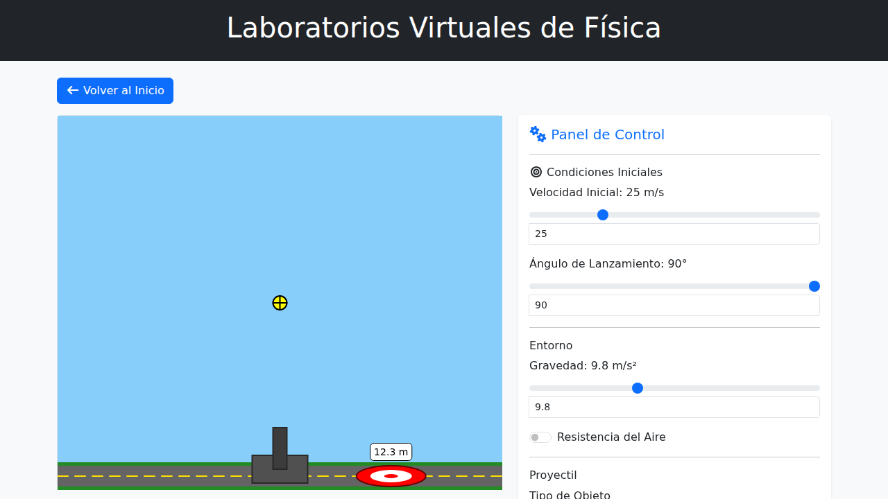
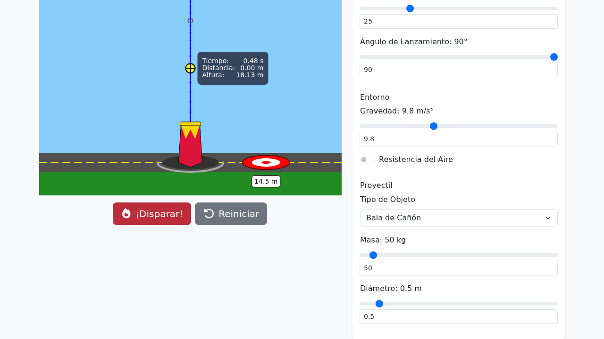
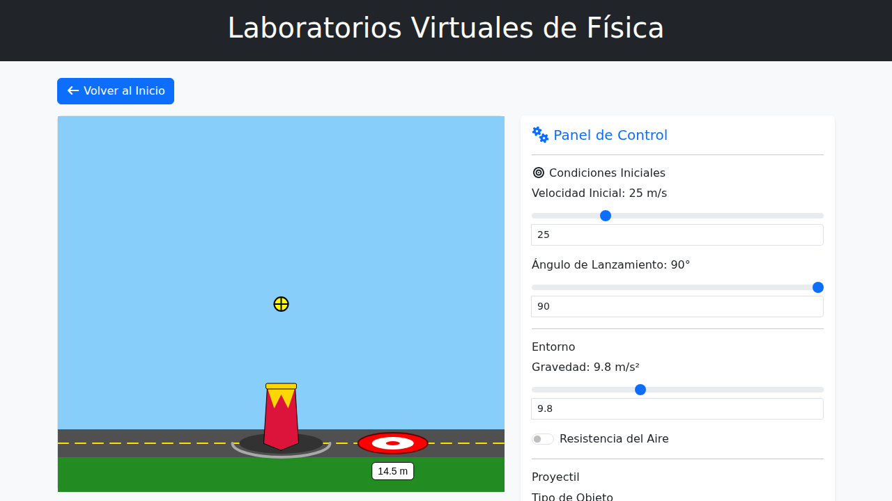
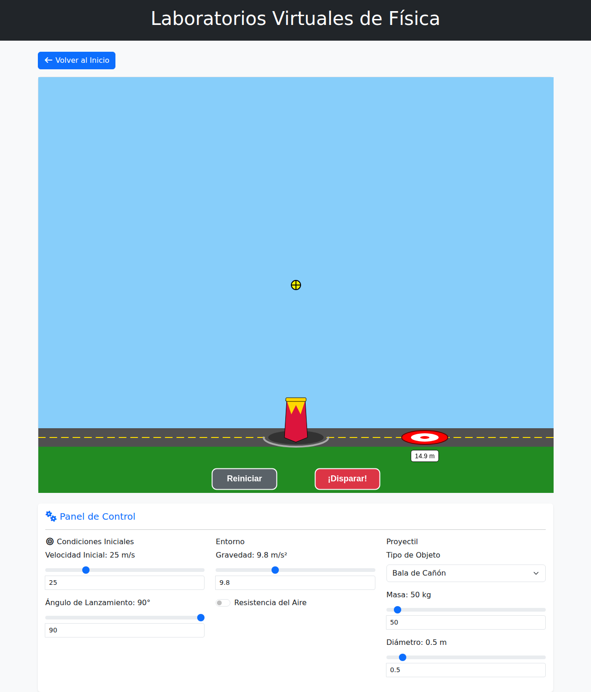

# Projectile Motion Simulation Updates

## Changes - 2024-05-22

### Visual Updates (Refined v3)
1.  **Fixed Mid-Air Collision**: Removed spherical collision check for the target. The projectile now always travels until it hits the ground plane (`landY`), ensuring it visually lands on the flat target instead of stopping in the air above it.
2.  **Trajectory Markers**: Maintained Green (Apex), Grey (Time), and Blue (Path) markers.
3.  **Cannon & Environment**: Maintained the Red Vase cannon and Road/Green layout.

### Verification

#### Before

#### After

## Changes - [Current Date]

### Layout & UI Updates
1.  **In-Canvas Buttons**: "¡Disparar!" (Fire) and "Reiniciar" (Reset) buttons have been moved inside the canvas area (bottom green section) for better visual integration.
2.  **Horizontal Control Panel**: The control panel has been moved below the canvas and restructured into a horizontal layout with three columns (Initial Conditions, Environment, Projectile) for improved usability on larger screens.
3.  **Fixed Cannon & Overlap Prevention**:
    -   The cannon is now fixed in position and cannot be dragged, preventing accidental displacement.
    -   The ground area height has been increased, and button positions adjusted to ensure the target distance label never overlaps with the buttons, even when the target is positioned nearby.

### Verification

#### Before (Layout Change)

#### After (Layout Change & Overlap Fix)

